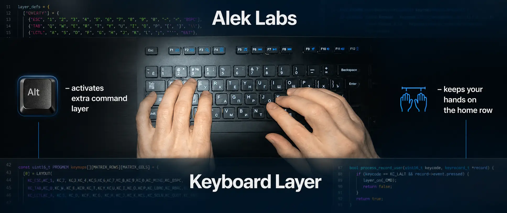

# Alek Labs Keyboard Layer

**An ergonomic keyboard command layer for Windows.**

Alek Labs Keyboard Layer is an AutoHotkey script that keeps QWERTY intact while adding a compact editing layer for navigation, selection, deletion, clipboard operations, undo, redo, and Enter. It is designed to reduce hand travel to Enter, arrow keys, Home, End, Delete, Backspace, and Ctrl-based shortcuts during writing and programming.

The core idea is simple: Caps Lock becomes Enter, and Left Alt becomes a temporary command-layer modifier. While Left Alt is held, nearby keys perform cursor movement, word-level navigation, line-level navigation, selection, deletion, and editing commands. Navigation is mostly operated by the right hand near the home position, while the left thumb activates the layer with Alt. Shift modifies navigation into selection, and Caps Lock modifies the Alt layer into deletion.

Clipboard operations are also moved closer to the home position. Copy, paste, cut, undo, redo, and select-all are available through Alt-based shortcuts on the left side of the keyboard, so frequent editing commands can be executed without repeatedly stretching to Ctrl combinations or moving the hands away from the main typing area. This is especially useful during programming sessions, where small edit operations are performed continuously across code editors, terminals, search fields, commit messages, documentation, and browser input fields.

The workflow remains non-modal: there is no persistent navigation mode, only short command chords that work inside ordinary Windows applications.

Project website: [https://aleklabs.dev/keyboard-layer](https://aleklabs.dev/keyboard-layer)

## Installation

Alek Labs Keyboard Layer requires [AutoHotkey](https://www.autohotkey.com/) on Windows.

### Recommended installation

1. Install [AutoHotkey](https://www.autohotkey.com/).
2. Download the latest release: [aleklabs-keyboard-layer.zip](https://github.com/AlekLabs/keyboard-layer/releases/latest/download/aleklabs-keyboard-layer.zip).
3. Extract the ZIP file.
4. Run `aleklabs-keyboard-layer.ahk`.

The release package includes the script, tray icon, README, and MIT license.

### Start automatically with Windows

To start the script after login:

1. Press `Win + R`.
2. Enter `shell:startup`.
3. Create a shortcut to `aleklabs-keyboard-layer.ahk` in the opened Startup folder.

### Script-only installation

You can also download only `aleklabs-keyboard-layer.ahk` from the repository and run it directly. If `aleklabs-keyboard-layer.ico` is missing, the script still works and uses the default AutoHotkey tray icon.
